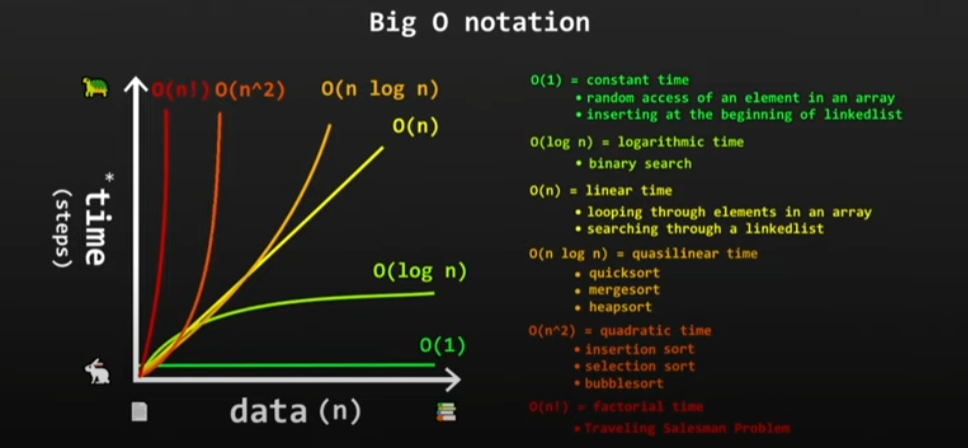

# Data Structures

> `Ways to store & organize data to efficiently access/retrieve data`
> 
- Containers storing data in a specific memory layout

# BIG O NOTATION

> `Performance(time or space) of algo as input size increases`
> 



### Array

```python
array = [6, 3, 9, 45, 78, 22, 108,111]

**# Access : O(1) , constant**
thirdElement = array[2]
print(thirdElement)  #9
# [6, 3, 9, 45, 78, 22, 108,111]

**# Search : O(n) , linear**
# eg search for first no. > 100
def findFirstMoreHundred(array):
    for n in array:
        if n > 100:
            return n
print(findFirstMoreHundred(array))
# [6, 3, 9, 45, 78, 22, 108,111]

**#Insertion : O(n) , pushes every element's index backward**
array.insert(0,100)
print(array)
# [100, 6, 3, 9, 45, 78, 22, 108,111]

**# Deletion : O(n) , after removal, pushes  every element's index forward** 
array.remove(array[0])
print(array)
# [6, 3, 9, 45, 78, 22, 108,111]
```

### Stack

- LIFO : Last-In, First-Out
- Insert : Append ([O(1)] Add to last index)
- Delete : Pop ([O(1)] Remove from last index)

```python
stack = [6, 3, 9, 45, 78]

**# Append : O(1) , constant**
stack .append(100)
# [6, 3, 9, 45, 78, 100]

**# Pop: O(1) , constant**
stack .pop()
# [6, 3, 9, 45, 78]
```

```python
stack = [6, 3, 9, 45, 78]

# Access : O(n) , need to pop every element to its right 
def accessStack(stack,elementNumber):
    while len(stack) > elementNumber:
        stack.pop()
    return stack.pop()
print(accessStack(stack,2)) 
# 6

# Search : O(n)
def accessStack(stack):
    while len(stack) > 0:
        x = stack.pop()
        if x < 10:
            return x
# 9
```

### Queue

- FIFO : First-In, First-Out

### Using dequeue object from collections module:

- Makes a deque (Double Ended Queue): Can add/remove objects from both end of queue. All en/de-que are **O(1)**

| Enqueue | `.append()` | Insert from right |
| --- | --- | --- |
|  | `.appendleft()` | Insert from left |
| Dequeue | `.pop(0)` | Remove from right |
|  | `.popleft()` | Remove from left |

```python
from collections import deque

d = deque('aloy')

# Enqueue
d.append('sius')
print(d)
	# deque(['a', 'l', 'o', 'y', 'sius'])

# Dequeue
d.pop()
print(d)
	# deque(['a', 'l', 'o', 'y'])
```

### Using List:

| Enqueue | `.append()`  | ([O(1)] Add to last index |
| --- | --- | --- |
| Dequeue | `.pop(0)` | ([O(n)] Remove from first index |

```python
q = []

# Enqueue
q.append('aloy')
print(q)
	# ['aloy']

# Dequeue
q.pop()
print(q)
	# []

```


### Hashmap

| Insert  | `.update()` |  [O(1)] or [O(n)] |
| --- | --- | --- |
| Delete  | `.pop()` |  ([O(1)] avg) |
| Retrieve | `.get()` |  ([O(1)] avg) |
- Collisions: >2 keys has to same index 
- Chaining
- Open Addressing

### Linked Lists

- 

| Insert | `.update()` | [O(1)] or [O(n)] |
| --- | --- | --- |
| Delete | `.pop()` | ([O(1)] avg) |
| Retrieve | `.get()` | ([O(1)] avg) |

cs

### Binary Tree

### Binary Search Tree